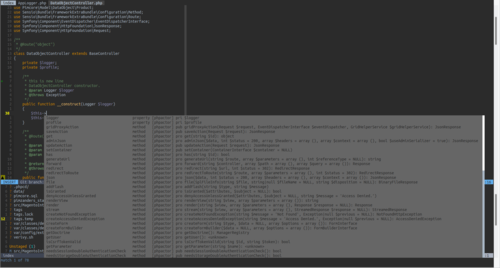

# vimde
The simple VIM distribution for PHP projects

## Features

Darcula theme (phpstorm darcula colors)             | GIT support
:----------------------------------:|:---------------------------------:
  |  

Filesystem tree view (NERDTree)     | Autocomplete
:----------------------------------:|:---------------------------------:
 | 

## Install

* Clone repo
* copy .vim/ and .vimrc onto your HOME
* create local .vimprojects file in HOME and list projects in the file
* install Ag
* install FZF
* install phpctags

## Documentation
[Keys](docs/index.md)
